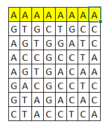

# Mercado Libre Chellenge

Spring Boot project for the challenge for Mercado Libre interview, developed by Thomas Herrera

## Environment

- Java 8
- Gradle
- AppEngine
- MySql

## Plugins and configuration

The projects use the following plugins:

- War
- Jacoco
- Cloud tools appengine
- Java
- Springframework boot
- Spring dependency management

## Repository

The code repository is in GitHub and is in a public repository that you can find in the next link:

https://github.com/thomasleo09/Xmen

You can download the project in a git shell withe command:

git clone https://github.com/thomasleo09/Xmen.git

## Execution

Verify that the port 8080 is free, if you want change the port you can do it in the folder of resources where you can find the properties

Run the command gradlew clean build for download dependencies and build the project

In the main folder you can find the SeguroCanguroChallengeApplication where you can run the app, you can run the next command if yoy prefer: gradle bootRun

## Google Cloud AppEngine

The project is hosted in google cloud, on an instance of app engine in the following link:

https://xmenproject.rj.r.appspot.com

If you want you can run a dev enviroment local for test with the next command: gradle appengineRun

And if yoy want you can deploy the changes in google cloud with the next command: gradle appengineDeploy

## Google cloud MySql

The database is hosted in google cloud too in an instance of my sql, the connection parameters are the following:

- url: jdbc:mysql://34.95.237.57:3306/xmendb
- username: root
- password: NIMeJu0bgA7pu67h

## Swagger.yaml

The endpoints and the way for consume are described in the swagger.yaml file in the same folder of this file

## Unit tests

The code has unit test in the pertinent file, in all the branches with a coverage like you can see in the next report

## Status

Actually the project is completely finished complying with all the requirements for the three levels as it appears in the guide document, there are two exposed endpoints, the one that analyzes if it is a mutant and the one that returns the statistics, in addition to that, a record is kept in the mySQL database hosted n google cloud for each DNA analyzed, although the endpoints are linked next but these are best described in the swagger.yaml file

- https://xmenproject.rj.r.appspot.com/mutant/
- https://xmenproject.rj.r.appspot.com/stats/

## Initial premises

According to the information provided in the guide, there were several premises that were taken into account before starting the development to be clear about it.

In the first instance, the possible cases of mutant DNA were evaluated and the following were found.

### Case 1
When it has two or more chains of four nitrogenous bases

### Case 2
When it has 2 or more chains of more than four nitrogenous bases

### Case 3
When you have 2 chains of four nitrogenous bases attached, that is, a chain of 8 nitrogenous bases

### Case 4
When 2 or more chains share a nitrogenous base

Taking this into account, it was taken as a premise that if a chain had 8 or more identical nitrogenous bases, it was considered as 2 different chains, that is, every 4 repeated regardless of whether they are joined, they are considered as separate chains.

In case it has 7 or less nitrogenous bases it is considered as a single chain.

For case 4 in which a nitrogenous base is shared, they are considered as two different ones since their direction changes, and for cases 1 and 2 it works in the same way

In addition to this, possible errors in the DNA chain were also taken into account, so there is a first method that analyzes if the chain is fine, that is to say that it is a totally square matrix and that only the characters that correspond to the nitrogenous bases are used in capital letter

It was also taken into account that there could be four possible directions in which a sequence could be carried out as seen in the image

As the verification is the same in the four directions, a single method was performed with the only variation of the vertical or horizontal increment to compare the following position

Thank you very much for your attention, any questions or comments I am available, my email is:

thomasleo09.tlhg@gmail.com

